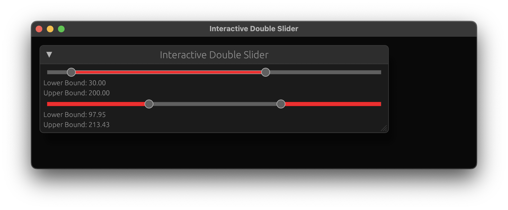

# egui Double Slider Widget

[](https://crates.io/crates/egui_double_slider)
[](https://docs.rs/egui_double_slider)
[](https://github.com/hacknus/egui_double_slider/actions/workflows/rust.yml)

A double slider widget for the GUI rust library [egui](https://github.com/emilk/egui).



Add double slider along with egui to your `cargo.toml`.

```toml
egui_double_slider = "0.4.0"
egui = "0.31"
```

To run the example:
```shell
cargo run --example example
```

Example code:

```rust
use egui_double_slider::DoubleSlider;
use egui;

fn main() {
    egui::__run_test_ui(|ui| {
        ui.add(
            DoubleSlider::new(
                &mut self.slider_val_low_1,
                &mut self.slider_val_high_1,
                10.0..=300.0,
            )
                .width(width)
                .separation_distance(10.0),
        );
    });
}
```

TODO:

- [ ] extend for integer, `f64`
- [ ] better connection to egui ctx style (like the normal Slider widget)